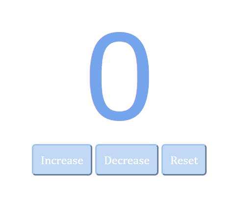

# CounterProject
This is basic javascript project with three buttons to increase, decrease and reset number

#Reset button click: resets counter to 0

#Increament button click: increases the counter by 1 each time

#Decrement button click: decreases the counter by 1 each time

